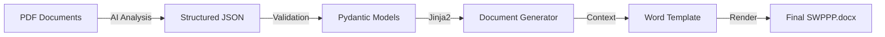

# AutoNarrative Developer Guide

This guide explains how the AutoNarrative system works, how to run it, and how to modify it.

## 🏗 System Architecture

The system has two main components:
1.  **Extraction Service**: Uses AI (Claude) to "read" PDF documents (Estimates, Storm Plans) and extract structured data.
2.  **Generation Service**: Takes structured data, validates it, and populates a Word template (`.docx`).



## 🚀 Running the Scripts

We have consolidated the scripts into the `scripts/` directory.

### 1. Run Extraction Demo

Extracts data from the sample PDFs in `data/samples/` and saves JSON to `data/extracted/`.

```bash
# Requires ANTHROPIC_API_KEY to be set
uv run python scripts/run_extraction_demo.py
```

### 2. Run Generation Demo

Takes hardcoded test data (simulating what we'd get from extraction) and fills the Word template. Saves to `templates/output/`.

```bash
uv run python scripts/run_generation_demo.py
```

---

## 📄 Working with Templates

The system uses **docxtpl** (Jinja2 for Word). You edit the template directly in Microsoft Word.

### How to Add Variables

1.  Open `templates/cgp_p3_template.docx`.
2.  Insert tags using double curly braces: `{{ variable_name }}`.
3.  Save the file.

### Common Variables

| Variable | Description |
| :--- | :--- |
| `{{ project_name }}` | Name of the project |
| `{{ project_address }}` | Full street address |
| `{{ city }}`, `{{ state }}` | City and State |
| `{{ permit_number }}` | NPDES/State permit number |
| `{{ owner_name }}` | Owner contact name |
| `{{ contractor_company }}` | Contractor company name |

*See `app/models/swppp.py` for the full list of available fields.*

### Advanced Logic

You can use logic inside the Word doc:
```jinja2

   Operator: {{ operator_name }}

```

---

## 🔍 AI Extraction Details

The extraction logic lives in `app/services/document_analyzer.py`.

*   **Input**: PDF files (Estimates, Plans).
*   **Process**:
    1.  Converts PDF pages to images.
    2.  Sends images to Claude 3.5 Sonnet with a specific prompt.
    3.  Claude returns JSON data matching our schema.
*   **Output**: Pydantic models (`app/models/swppp_variables.py`).

To improve extraction:
1.  Modify the prompts in `app/services/document_analyzer.py`.
2.  Add new fields to the Pydantic models.
