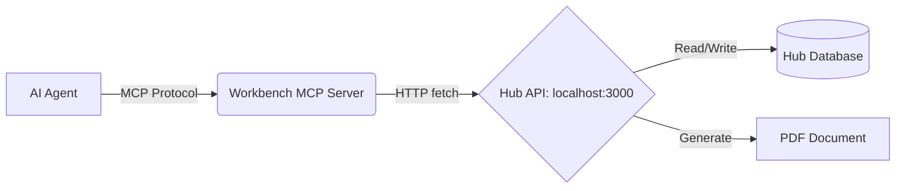

# System Integration & Architecture

This document outlines the architecture and integration between `ds-workbench` and `desert-services-hub`, specifically focusing on the Quoting system.

## Overview

The system is split into two main components:
1.  **Desert Services Hub**: The core application, source of truth, and UI.
2.  **DS Workbench**: The developer tooling, AI interface (MCP), and local test scripts.

## Component: Desert Services Hub
*   **Location**: `desert-services-hub/`
*   **Stack**: Next.js 16 (App Router), React 19, Tailwind, SQLite (`bun:sqlite`).
*   **Role**:
    *   **Source of Truth**: Manages the production database (`data/desert-services.db`).
    *   **API Provider**: Exposes REST endpoints (e.g., `/api/quotes`) for external tools.
    *   **UI**: Provides the browser-based interface for users.
    *   **PDF Generation**: Contains the production logic for generating PDFs (`lib/pdf/generate.ts`) served via API.

## Component: DS Workbench (Quoting Service)
*   **Location**: `ds-workbench/services/quoting/`
*   **Stack**: Bun.
*   **Role**:
    *   **AI Interface**: Runs the MCP Server (`mcp-server.ts`) that allows AI agents to interact with the system.
    *   **Local Testing**: Contains scripts for rapid development and testing of core logic (e.g., PDF layouts).

### Integration Points

The integration between Workbench and Hub is primarily through **HTTP** when running the MCP Server.



### Modes of Operation

#### 1. MCP Server Mode (Bridge)
*   **Entry Point**: `bun run services/quoting/mcp-server.ts`
*   **Behavior**:
    *   Acting as a **client** to the Hub.
    *   **Does NOT** access local databases (`quotes.db`).
    *   **Does NOT** generate PDFs locally; it requests them from the Hub API.
*   **Use Case**: When the AI needs to "list quotes", "create quote", or "download pdf".

#### 2. Local/Legacy Mode (Standalone)
*   **Example**: `test-multipage.ts`, `services/quoting/client.ts`
*   **Behavior**:
    *   Uses **local libraries** (`pdf.ts`, `catalog.ts`) directly.
    *   **Does NOT** communicate with the Hub.
    *   Generates artifacts (like PDFs) locally on the filesystem.
*   **Use Case**: Rapid iteration on PDF layouts (`test-multipage.ts`) or catalog updates without running the full Next.js stack.

## Technical Debt & Duplication

Be aware of the following duplications between the two repositories:

1.  **PDF Generation Logic**:
    *   **Hub**: `desert-services-hub/lib/pdf/generate.ts` (Production)
    *   **Workbench**: `ds-workbench/services/quoting/pdf.ts` (Local/Test)
    *   **Risk**: Changes to the PDF design must be manually applied to both files to keep `test-multipage.ts` accurate.

2.  **Data Models**:
    *   Types for Quotes and Line Items are defined in both `ds-workbench/services/quoting/types.ts` and `desert-services-hub/lib/types.ts`.

## Setup Verification

To verify the ecosystem is working:

1.  **Start Hub**:
    ```bash
    cd desert-services-hub
    npm run dev
    # Verify: http://localhost:3000/api/quotes returns JSON
    ```

2.  **Start MCP Server** (if testing AI integration):
    ```bash
    cd ds-workbench
    bun run services/quoting/mcp-server.ts
    ```

3.  **Run Local Tests** (if testing PDF layout):
    ```bash
    cd ds-workbench
    bun run test-multipage.ts
    # Verify: Opens a PDF file locally
    ```
