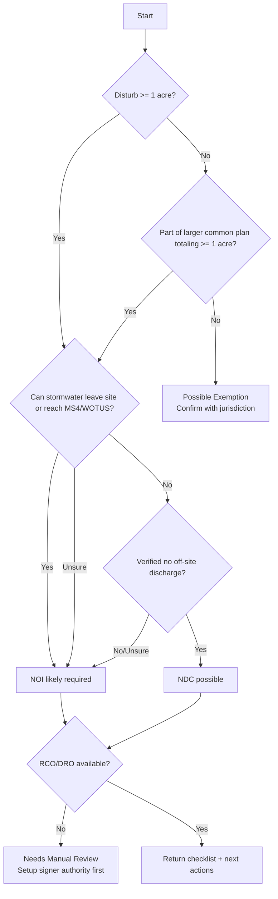

# Permit Path Checker Logic (NOI vs NDC)

## What It Is
A lightweight decision engine that asks a short set of project questions and returns:

- likely path (`NOI`, `NDC`, `Possible Exemption`, or `Needs Manual Review`)
- why that path was chosen
- exact next steps and required data to finish filing

It is not a legal opinion tool. It is an operational pre-check to reduce filing errors.

## Inputs Collected
- disturbed acreage
- part of larger common plan (yes/no)
- can stormwater leave site boundary (yes/no/unsure)
- discharge route (direct to waterbody, MS4/storm drain, none, unknown)
- receiving waterbody known (yes/no)
- project municipality
- signer role available (RCO/DRO/none)
- SWPPP status (prepared/not prepared)

## Decision Outcomes
- `NOI likely required`: any off-site discharge, potential discharge, or uncertainty
- `NDC possible`: no off-site discharge and controls keep stormwater on-site
- `Possible exemption`: less than 1 acre and not part of a 1+ acre common plan (requires confirmation)
- `Needs manual review`: conflicting answers, missing signer authority, or unclear discharge path

## Output Package
- one-line recommendation
- reason summary (2-4 bullets)
- data checklist for myDEQ submission
- warning flags that need human review
- CTA: file internally or escalate to Desert Services support

## Decision Tree (MVP)

## MVP Rule Notes
- if answer is `unsure` on discharge, default to `NOI likely required`
- if signer role is missing, block final recommendation as actionable submission
- preserve all answers as audit metadata with timestamp and source version
